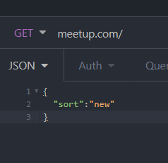

  
## homepage  
- GET url.com/  
1. if (GET REQUEST HAS JSON IN THE BODY){  
    - **(would look something like this)**  
    -   
    - we will return a sorted query of the posts by the users choice
2. } else (get request does not have json body) {  
    - default will return posts sorted by top  
    - (also default to top if json body doesnt match ["New", "Upcoming", "Nearby"])
}  
<!-- app.get('/') -->
  
## viewing a specific page  
- GET /post/:id  
- PUT /post/:id  
- DELETE /post/:id 

Get

<!-- router.get("/" ,(req,res) =>{

});
.route("/post/:id")
.get((req,res) =>{});
.put((req,res) =>{});
.delete((req,res) =>{}); -->

### commenting on a post
- CREATE /post/comment/
- DELETE /post/comment/:id

<!-- router.get("/" ,(req,res) =>{

});
.route("/post/comment/")
.get((req,res) =>{});
.put((req,res) =>{});
.delete((req,res) =>{}); -->
  
## viewing a specific user*  
- GET /user/:id  
- PUT /user/:id  
  
## goto the login page <- session stuff*  
- GET /user/login/  
  
## goto the sign up page <- create* element in the database  
- GET /user/register/  
- CREATE /user/register/